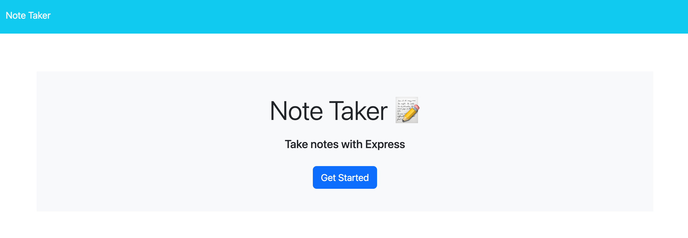
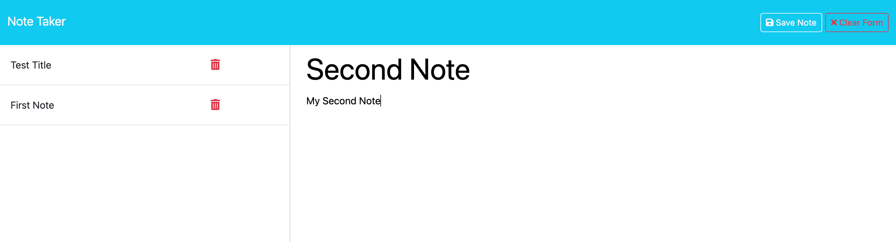

# Note Taker Application
This application is used to write and save notes. 
When the user opens the Note Taker, they are presented with a landing page with a link to a notes page.
In the notes page, previous existing notes are displayed in the left-hand colum, and the user has the option to create a new note title and text. The user can save the note or clear it using the 'Save Note' and 'Clear Form' buttons.
Once a note is saved it will be displayed in the left-hand colum.
When the user presses the 'New Note' button at the top of the page, then they are presented with empty fields to enter a new note title and note text.

